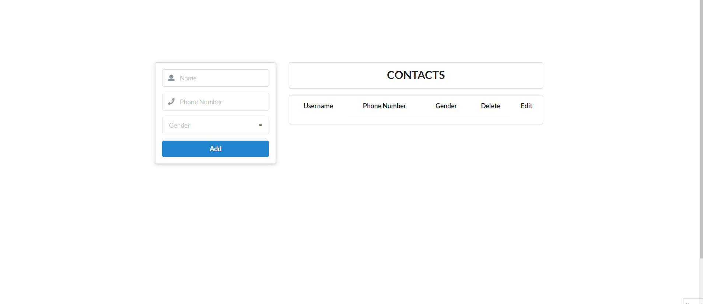

# Contact App with React/Firebase

I've used React/Semantic UI for creating the app. Data is stored on Firebase Realtime Database.You can add, edit and update contacts.
Change credentials in `firebase.js` file with yours.

